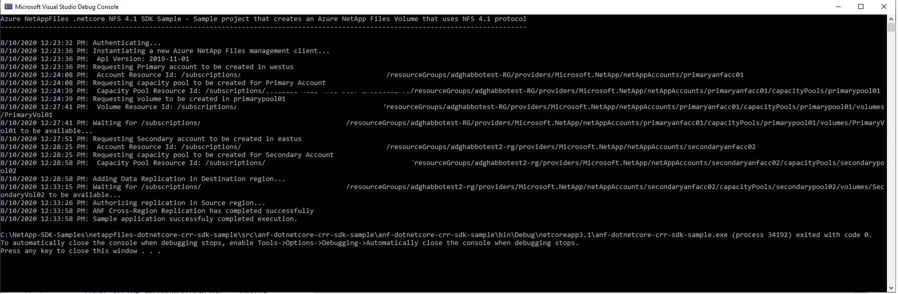

# Azure NetAppFiles Cross-Region Replication (CRR) SDK NFS 4.1 Sample .NETCore

This project demonstrates how to deploy a cross-region replication with enabled with NFS 4.1 protocol volume using dotnet-core language and Azure NetApp Files SDK.

In this sample application we perform the following operations:

* Creation
  * Primary ANF Account
	| Primary Capacity pool 
		| Primary NFS v4.1 Volume 
		
 * Secondary ANF Account
	| Secondary Capacity pool
		| Secondary NFS v.1 Data Replication Volume with referencing to the primary volume Resource ID
			
 * Authorize Source volume with Desitnation Volume Resource ID


If you don't already have a Microsoft Azure subscription, you can get a FREE trial account [here](http://go.microsoft.com/fwlink/?LinkId=330212).

## Prerequisites

1. Azure Subscription
1. Subscription needs to be whitelisted for Azure NetApp Files. For more information, please refer to [this](https://docs.microsoft.com/azure/azure-netapp-files/azure-netapp-files-register#waitlist) document.
1. Resource Group created
1. Virtual Network with a delegated subnet to Microsoft.Netapp/volumes resource. For more information, please refer to [Guidelines for Azure NetApp Files network planning](https://docs.microsoft.com/en-us/azure/azure-netapp-files/azure-netapp-files-network-topologies)
1. For this sample console appplication work, we are using service principal based  authenticate, follow these steps in order to setup authentication:
    1. Within an [Azure Cloud Shell](https://docs.microsoft.com/en-us/azure/cloud-shell/quickstart) session, make sure you're logged on at the subscription where you want to be associated with the service principal by default:
        ```bash
        az account show
        ```
        If this is not the correct subscription, use             
          ```bash
         az account set -s <subscription name or id>  
         ```
    1. Create a service principal using Azure CLI
        ```bash
        az ad sp create-for-rbac --sdk-auth
        ```

        >Note: this command will automatically assign RBAC contributor role to the service principal at subscription level, you can narrow down the scope to the specific resource group where your tests will create the resources.

    1. Copy the output content and paste it in a file called azureauth.json and secure it with file system permissions
    1. Set an environment variable pointing to the file path you just created, here is an example with Powershell and bash:
        Powershell 
        ```powershell
       [Environment]::SetEnvironmentVariable("AZURE_AUTH_LOCATION", "C:\sdksample\azureauth.json", "User")
       ```
        Bash
        ```bash
        export AZURE_AUTH_LOCATION=/sdksamples/azureauth.json
        ``` 

        >Note: for more information on service principal authentication with dotnet, please refer to [Authenticate with the Azure Libraries for .NET](https://docs.microsoft.com/en-us/dotnet/azure/dotnet-sdk-azure-authenticate?view=azure-dotnet)

# What is anf-dotnetcore-crr-sdk-nfs4.1-sample.dll doing? 

This sample project is dedicated to demonstrate how to deploy a cross-region replication in Azure NetApp Files that uses NFS v4.1 protocol, similar to other examples, the authentication method is based on a service principal, this project will create two ANF Accounts in different regions with capacity pool. A single volume using standard service level tier and an NFS protocol in the Source ANF, and Data Replication Volume with the same properties in the destination ANF. 

# How the project is structured

The following table describes all files within this solution:

| Folder      | FileName                | Description                                                                                                                         |
|-------------|-------------------------|-------------------------------------------------------------------------------------------------------------------------------------|
| Root        | program.cs              | Authenticates and executes all operations                                                                                           |
| Root\Common | ResourceUriUtils.cs     | Static class that exposes some methods that helps parsing Uris, building a new Uris or getting a resource name from Uri for example |
| Root\Common | ServicePrincipalAuth.cs | Small static class used when working with Service Principal based authentication                                                    |
| Root\Common | Utils.cs                | Static class that exposes a few methods that helps on various tasks, like writting a log to the console for example.                |
| Root\Model  | AzureAuthInfo.cs        | Class that defines an Azure AD Service Principal authentication file                                                                |

# How to run the console application

1. Clone it locally
    ```powershell
    git clone https://github.com/Azure-Samples/netappfiles-dotnetcore-nfs4.1-sdk-sample.git
    ```
1. Make sure you change the variables located at **.netappfiles-dotnetcore-crr-sdk-sample\src\anf-dotnetcore-crr-sdk-sample\anf-dotnetcore-crr-sdk-sample\program.cs at RunAsync method.**
1. Change folder to **.netappfiles-dotnetcore-crr-sdk-sample\src\anf-dotnetcore-crr-sdk-sample**
1. Since we're using service principal authentication flow, make sure you have the **azureauth.json** and its environment variable with the path to it defined (as previously described)
1. Build the console application
    ```powershell
    dotnet build
    ```
1. Run the console application
    ```powershell
    dotnet run
    ```

Sample output


# References

* [Azure NetAppFiles SDK Sample for .NETCore - More advanced example](https://docs.microsoft.com/en-us/samples/azure-samples/netappfiles-dotnetcore-sdk-sample/azure-netappfiles-sdk-sample-for-netcore/)
* [Authenticate with the Azure Libraries for .NET](https://docs.microsoft.com/en-us/dotnet/azure/dotnet-sdk-azure-authenticate?view=azure-dotnet)
* [Resource limits for Azure NetApp Files](https://docs.microsoft.com/en-us/azure/azure-netapp-files/azure-netapp-files-resource-limits)
* [Azure Cloud Shell](https://docs.microsoft.com/en-us/azure/cloud-shell/quickstart)
* [Azure NetApp Files documentation](https://docs.microsoft.com/en-us/azure/azure-netapp-files/)
* [Download Azure SDKs](https://azure.microsoft.com/downloads/)
 
